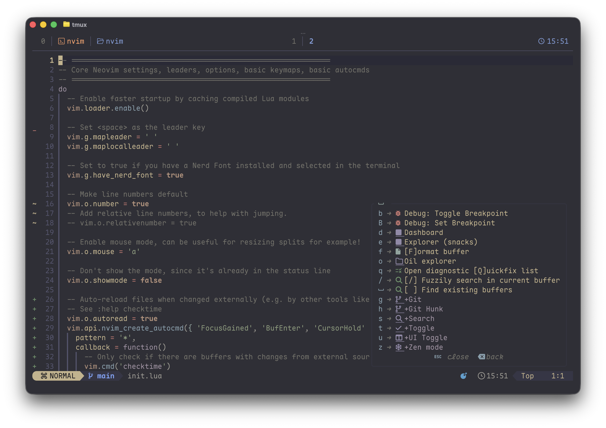

# Neovim Config

Personal Neovim config based on **kickstart.nvim**.  
Features: LSP auto-setup, fuzzy finding (Telescope), inline markdown rendering, blink.cmp autocompletion, treesitter syntax highlighting, git integration (gitsigns), debugger support (DAP), and multiple colorschemes with Kanagawa Paper as default.
