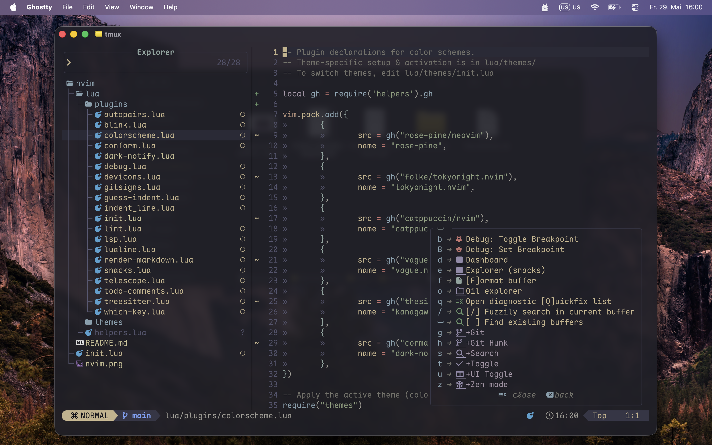

# Neovim Config

Personal Neovim config based on [kickstart.nvim](https://github.com/nvim-lua/kickstart.nvim).

- **LSP** — Auto-setup with Mason, fidget notifications, inlay hints
- **Completion** — blink.cmp + LuaSnip snippets
- **Fuzzy finding** — Telescope with fzf-native
- **Syntax** — Treesitter highlighting & indentation
- **Git** — Gitsigns signs, hunks, blame, diff
- **Debugging** — nvim-dap + DAP UI (Go with Delve)
- **Formatters & linters** — conform.nvim, nvim-lint
- **Markdown** — Inline rendering with callouts, tables, checkboxes
- **Themes** — Kanagawa Paper, Tokyo Night, Catppuccin, Rose Pine, Vague
- **Extra** — which-key, todo-comments, render-markdown, snacks.nvim (dashboard, explorer, zen mode)
